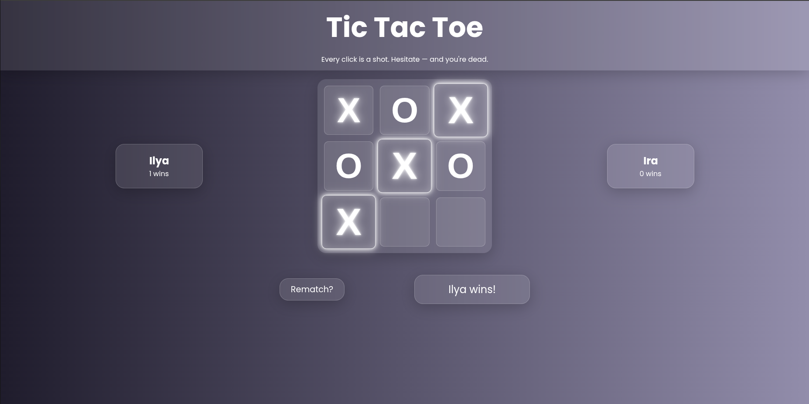

# Tic-Tac-Toe: Neon Fight



**[Live Demo](https://ligect.github.io/Tic-Tac-Toe/)**

## Features

- 🌟 **Neon Visuals**: Glowing X and O markers with winning line animations
- 👥 **Player Customization**: Enter player names before starting the game
- 📊 **Score Tracking**: Win counts displayed for each player
- 🎮 **Interactive Gameplay**: Clean, intuitive interface with responsive cells
- 📱 **Mobile Responsive**: Fully playable on all device sizes
- 🏆 **Win Detection**: Automatic detection of wins and draws
- 🔁 **Rematch Option**: Quick restart for continuous play

### Game Logic

- **Gameboard Module**: Manages the game state and board operations
- **Player Factory**: Creates player objects with names, markers, and scores
- **Game Controller**: Handles game flow, win detection, and player turns

### UI Components

- **Start Modal**: For player name input
- **Game Board**: 3x3 grid with interactive cells
- **Player Cards**: Displays player names and scores with active player highlighting
- **Status Area**: Shows game messages and rematch button

### Visual Design

- Gradient background with glass-morphism elements
- Neon glow effects for markers and winning lines
- Smooth animations and hover effects
- Responsive layout for all screen sizes

## How to Play

1. Enter player names in the start modal
2. Player X goes first (click any cell)
3. Alternate turns until a player gets three in a row
4. The winning line will glow with a neon animation
5. Click "Rematch?" to play again with the same players

## Development Setup

1. Clone the repository:

```bash
git clone https://github.com/ligect/Tic-Tac-Toe.git
```

2. Open `index.html` in your browser

## Technologies Used

- Vanilla JavaScript (ES6 Modules)
- HTML5
- CSS3 (Flexbox, Grid, Animations)
- Glassmorphism design principles
- Responsive Web Design
